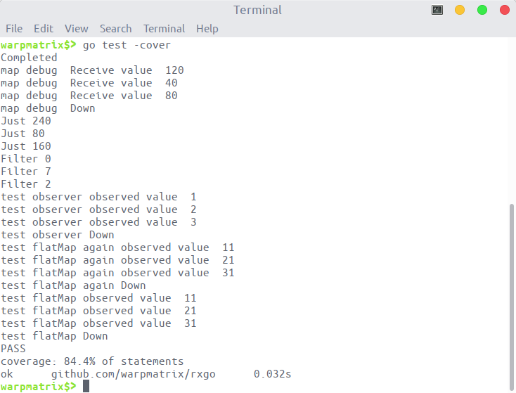
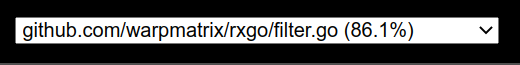
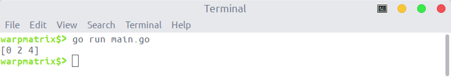
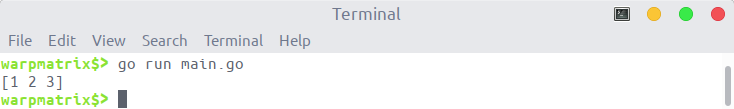
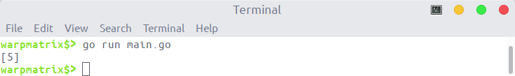
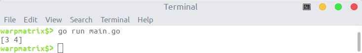
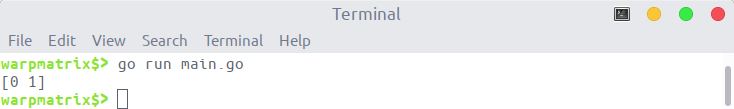
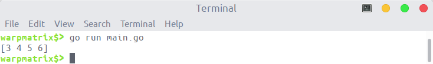

<!-- omit in toc -->
# Specification

[pmlpml/RxGo](https://github.com/pmlpml/rxgo) 模仿 Java 版写了 Go 版本新实现，已基本实现了 Creating Observables 和 Transforming Observables 两类算子。

本项目在没有修改先前框架的前提下，添加了一组新的操作 filtering。主要的操作可以在 [ReactiveX 官网](http://reactivex.io/documentation/operators.html) 进行查询：

> - [Debounce](http://reactivex.io/documentation/operators/debounce.html) — only emit an item from an Observable if a particular timespan has passed without it emitting another item
> - [Distinct](http://reactivex.io/documentation/operators/distinct.html) — suppress duplicate items emitted by an Observable
> - [ElementAt](http://reactivex.io/documentation/operators/elementat.html) — emit only item n emitted by an Observable
> - [Filter](http://reactivex.io/documentation/operators/filter.html) — emit only those items from an Observable that pass a predicate test
> - [First](http://reactivex.io/documentation/operators/first.html) — emit only the first item, or the first item that meets a condition, from an Observable
> - [IgnoreElements](http://reactivex.io/documentation/operators/ignoreelements.html) — do not emit any items from an Observable but mirror its termination notification
> - [Last](http://reactivex.io/documentation/operators/last.html) — emit only the last item emitted by an Observable
> - [Sample](http://reactivex.io/documentation/operators/sample.html) — emit the most recent item emitted by an Observable within periodic time intervals
> - [Skip](http://reactivex.io/documentation/operators/skip.html) — suppress the first n items emitted by an Observable
> - [SkipLast](http://reactivex.io/documentation/operators/skiplast.html) — suppress the last n items emitted by an Observable
> - [Take](http://reactivex.io/documentation/operators/take.html) — emit only the first n items emitted by an Observable
> - [TakeLast](http://reactivex.io/documentation/operators/takelast.html) — emit only the last n items emitted by an Observable

其中，filter 操作已经在 `transform.go` 文件中实现，下面的设计说明与单元测试将不再提及。

<!-- omit in toc -->
## Table of Contents

- [设计说明](#设计说明)
  - [主要框架](#主要框架)
  - [辅助方法](#辅助方法)
  - [具体实现](#具体实现)
- [单元测试结果](#单元测试结果)
- [功能测试结果](#功能测试结果)

## 设计说明

### 主要框架

本次对 pmlpml/RxGo 库的改进满足开放封闭原则。在没有修改先前代码的基础上，增加新的 `filter.go` 文件完成 filter 操作的增加。

observerable 等一系列原有的结构体保持不变。`filter.go` 文件中增加了一个 `filtOperator` 结构体实现 `streamOperator` 接口，以完成对应的 filter 操作。

```go
// filter node implementation of streamOperator
type filtOperator struct {
    opFunc func(ctx context.Context, o *Observable, in chan interface{}, out chan interface{}) (end bool)
}

func (fop filtOperator) op(ctx context.Context, o *Observable) {
    in := o.pred.outflow
    out := o.outflow

    // Scheduler
    go func() {
        fop.opFunc(ctx, o, in, out)
        o.closeFlow(out)
    }()
}
```

调用链和原本的 pmlpml/RxGo 库中基本保持一致：

1. 在 `filter.go` 文件中定义了 `Observable` 相应的 filter 操作方法。
2. 方法中的参数（变量、函数等）通过 `Observable.flip` 字段进行传递。这些参数可以直接赋值传递，也可以通过闭包进行传递。
3. 将每个操作预先定义相应的 `filtOperator` 变量赋值给 `Observable.operator`，等待后续的调用。该 `operator` 的主要用途为定义具体的操作行为或调用 `Observable.flip` 函数。

### 辅助方法

`filter.go` 文件中定义了一些辅助方法，如：创建新的 `Observable` 对象、定义默认的 `operator` 变量。具体的代码如下：

```go
func (parent *Observable) newFilterObservable(name string) (o *Observable) {
    //new Observable
    o = newObservable()
    o.Name = name
    //chain Observables
    parent.next = o
    o.pred = parent
    o.root = parent.root
    return o
}

var defaultOperator = filtOperator{func(ctx context.Context, o *Observable, in chan interface{}, out chan interface{}) (end bool) {
    fv := reflect.ValueOf(o.flip)
    params := []reflect.Value{reflect.ValueOf(ctx), reflect.ValueOf(in), reflect.ValueOf(out)}
    fv.Call(params)
    return true
}}
```

### 具体实现

一组 filtering 操作共有 12 个具体的行为，需要我们实现 11 个具体的操作。

- Debounce 操作符会过滤掉发射速率过快的数据项，仅在过了一段指定的时间还没发射数据时才发射一个数据。

    主要的实现方式为接收对应的等待时间段，并维护两个 go 程：一个用于监听输入的信道；另一个用于计时等过了指定的时间段，发送最近接收的数据项。

    ```go
    // Debounce only emit an item from an Observable if a particular timespan has passed without it emitting another item
    func (parent *Observable) Debounce(timespan time.Duration) (o *Observable) {
        o = parent.newFilterObservable("debounce")
        o.flip = func(ctx context.Context, in chan interface{}, out chan interface{}) (end bool) {
            var latest reflect.Value
            go func() {
                for !end {
                    <-time.After(timespan)
                    if latest != reflect.ValueOf(nil) {
                        if o.sendToFlow(ctx, latest.Interface(), out) {
                            end = true
                        }
                        latest = reflect.ValueOf(nil)
                    }
                }
            }()

            for !end {
                select {
                case <-ctx.Done():
                    end = true
                case item, ok := <-in:
                    if !ok {
                        end = true
                    }
                    latest = reflect.ValueOf(item)
                }
            }
            return
        }
        o.operator = debounceOperator
        return o
    }

    var debounceOperator = defaultOperator
    ```

- Distinct 抑制（过滤掉）重复的数据项，只允许还没有发射过的数据项通过。

    该操作允许你调整判定两个数据不同(distinct)的标准，提供了一个接口 `cmpKeyFunc`。对每一个数据项使用自己的 key 进行判断两个数据项是否相等。若 `cmpKeyFunc` 返回的是数据项本身，即自身映射，则直接使用数据项进行比较。

    在具体实现时，使用了 `keyset := make(map[interface{}]struct{})` 作为 set 数据结构，判断两个数据项是否相等。

    ```go
    // used in distinct operator
    type cmpKeyFunc func(interface{}) interface{}

    // Distinct suppress duplicate items emitted by an Observable
    func (parent *Observable) Distinct(f cmpKeyFunc) (o *Observable) {
        o = parent.newFilterObservable("distinct")
        o.flip = f
        o.operator = distinctOperator
        return o
    }

    var distinctOperator = filtOperator{func(ctx context.Context, o *Observable, in chan interface{}, out chan interface{}) (end bool) {
        keyset := make(map[interface{}]struct{})
        fv := o.flip.(cmpKeyFunc)
        for !end {
            select {
            case <-ctx.Done():
                end = true
            case item, ok := <-in:
                if !ok {
                    end = true
                    break
                }
                itemVal := reflect.ValueOf(item)
                key := fv(itemVal.Interface())
                _, hasKey := keyset[key]
                if !hasKey {
                    keyset[key] = struct{}{}
                    if o.sendToFlow(ctx, itemVal.Interface(), out) {
                        return
                    }
                }
            }
        }
        return
    }}
    ```

- ElementAt 操作符获取原始Observable发射的数据序列指定索引位置的数据项，然后当做自己的唯一数据发射。

    具体实现需要维护一个临时变量记录当前的索引位置。当接收到第 n 项数据，就将其发送出去。

    ```go
    // ElementAt emit only item n emitted by an Observable
    func (parent *Observable) ElementAt(n uint) (o *Observable) {
        o = parent.newFilterObservable("ElementAt")
        o.flip = func(ctx context.Context, in chan interface{}, out chan interface{}) (end bool) {
            i := uint(0)
            for !end {
                select {
                case <-ctx.Done():
                    end = true
                case item, ok := <-in:
                    if !ok {
                        end = true
                        break
                    }
                    itemVal := reflect.ValueOf(item)
                    if i == n {
                        if o.sendToFlow(ctx, itemVal.Interface(), out) {
                            end = true
                            return
                        }
                    }
                    i++
                }
            }
            return
        }
        o.operator = elementAtOperator
        return o
    }

    var elementAtOperator = defaultOperator
    ```

- First 只发射第一项（或者满足某个条件的第一项）数据

    First 方法可以接收一个函数作为自己的参数，用于判断满足条件的第一项数据。若接收一个返回 true 的函数，即返回接收数据的第一项。

    ```go
    // First emit only the first item, or the first item that meets a condition, from an Observable
    func (parent *Observable) First(f interface{}) (o *Observable) {
        o = parent.newFilterObservable("First")
        fv := reflect.ValueOf(f)
        inType := []reflect.Type{typeAny}
        outType := []reflect.Type{typeBool}
        b, ctxSup := checkFuncUpcast(fv, inType, outType, true)
        if !b {
            panic(ErrFuncFlip)
        }
        o.flip_accept_error = checkFuncAcceptError(fv)
        o.flip_sup_ctx = ctxSup
        o.flip = fv.Interface()
        o.operator = firstOperator
        return o
    }

    var firstOperator = filtOperator{func(ctx context.Context, o *Observable, in chan interface{}, out chan interface{}) (end bool) {
        fv := reflect.ValueOf(o.flip)
        for x := range in {
            if end {
                break
            }
            xv := reflect.ValueOf(x)
            params := []reflect.Value{xv}
            rs, skip, stop, e := userFuncCall(fv, params)
            var item interface{} = rs[0].Interface()
            if stop {
                end = true
                continue
            }
            if skip {
                continue
            }
            if e != nil {
                item = e
            }
            // send data
            if !end {
                if b, ok := item.(bool); ok && b {
                    o.sendToFlow(ctx, xv.Interface(), out)
                    end = true
                }
            }
        }
        return
    }}
    ```

- IgnoreElements 操作符抑制原始 Observable 发射的所有数据，只允许它的终止通知（onError 或 onCompleted）通过。

    由于不发送数据项，定义相应的空操作即可完成需求。

    ```go
    // IgnoreElements do not emit any items from an Observable but mirror its termination notification
    func (parent *Observable) IgnoreElements() (o *Observable) {
        o = parent.newFilterObservable("IgnoreElements")
        o.operator = ignoreElementsOperator
        return o
    }

    var ignoreElementsOperator = filtOperator{func(ctx context.Context, o *Observable, in chan interface{}, out chan interface{}) (end bool) {
        for !end {
            select {
            case <-ctx.Done():
                end = true
            case _, ok := <-in:
                if !ok {
                    end = true
                    break
                }
            }
        }
        return
    }}
    ```

- Last 只发射最后一项（或者满足某个条件的最后一项）数据。

    该方法与 `First` 方法大致相同，只不过需要等待接收的数据发送完毕后，返回最后一个满足条件的接收数据项即可。

    ```go
    // Last emit only the last item emitted by an Observable
    func (parent *Observable) Last(f interface{}) (o *Observable) {
        o = parent.newFilterObservable("Last")
        fv := reflect.ValueOf(f)
        inType := []reflect.Type{typeAny}
        outType := []reflect.Type{typeBool}
        b, ctxSup := checkFuncUpcast(fv, inType, outType, true)
        if !b {
            panic(ErrFuncFlip)
        }
        o.flip_accept_error = checkFuncAcceptError(fv)
        o.flip_sup_ctx = ctxSup
        o.flip = fv.Interface()
        o.operator = lastOperator
        return o
    }

    var lastOperator = filtOperator{func(ctx context.Context, o *Observable, in chan interface{}, out chan interface{}) (end bool) {
        fv := reflect.ValueOf(o.flip)
        var last reflect.Value
        for x := range in {
            if end {
                break
            }
            xv := reflect.ValueOf(x)
            params := []reflect.Value{xv}
            rs, skip, stop, e := userFuncCall(fv, params)
            var item interface{} = rs[0].Interface()
            if stop {
                end = true
                continue
            }
            if skip {
                continue
            }
            if e != nil {
                item = e
            }
            // send data
            if !end {
                if b, ok := item.(bool); ok && b {
                    last = xv
                }
            }
        }
        if last != reflect.ValueOf(nil) {
            end = o.sendToFlow(ctx, last.Interface(), out)
        }
        return
    }}
    ```

- Sample 操作符定时查看一个 Observable，然后发射自上次采样以来它最近发射的数据。

    该操作与 `debounce` 操作类似，具体的实现方法是维护两个信道：一个输入信道，另外一个采样信道。当接收到输入信道的数据时，将数据保存到变量中。当接收到采样信道的数据时，将最近接收到的输入信道的数据发送到输出信道中。

    ```go
    // Sample emit the most recent item emitted by an Observable within periodic time intervals
    func (parent *Observable) Sample(smpChan chan interface{}) (o *Observable) {
        o = parent.newFilterObservable("Sample")
        o.flip = func(ctx context.Context, in chan interface{}, out chan interface{}) (end bool) {
            var latest reflect.Value
            for !end {
                select {
                case <-ctx.Done():
                    end = true
                case item, ok := <-in:
                    if !ok {
                        end = true
                        break
                    }
                    latest = reflect.ValueOf(item)
                case <-smpChan:
                    if latest != reflect.ValueOf(nil) {
                        if o.sendToFlow(ctx, latest.Interface(), out) {
                            end = true
                            return
                        }
                        latest = reflect.ValueOf(nil)
                    }
                }
            }
            return
        }
        o.operator = sampleOperator
        return o
    }

    var sampleOperator = defaultOperator
    ```

- Skip 可以忽略 Observable 发射的前 N 项数据，只保留之后的数据。

    通过一个临时变量记录当前数据项的索引位置，跳过前 N 个接收到的数据项，即可完成需求。

    ```go
    // Skip suppress the first n items emitted by an Observable
    func (parent *Observable) Skip(n int) (o *Observable) {
        o = parent.newFilterObservable("Skip")
        o.flip = func(ctx context.Context, in chan interface{}, out chan interface{}) (end bool) {
            i := 0
            for !end {
                select {
                case <-ctx.Done():
                    end = true
                case item, ok := <-in:
                    if !ok {
                        end = true
                        break
                    }
                    if i < n {
                        i++
                        continue
                    }
                    xVal := reflect.ValueOf(item)
                    if o.sendToFlow(ctx, xVal.Interface(), out) {
                        end = true
                        return
                    }
                }
            }
            return
        }
        o.operator = skipOperator
        return o
    }

    var skipOperator = defaultOperator
    ```

- SkipLast 可以忽略 Observable 发射的后 N 项数据，只保留前面的数据。

    实现这一需求也需要记录数据项的索引位置，等到接收第 n+i 个数据后，即可发送前 i 个数据。

    ```go
    // SkipLast suppress the last n items emitted by an Observable
    func (parent *Observable) SkipLast(n int) (o *Observable) {
        o = parent.newFilterObservable("SkipLast")
        o.flip = func(ctx context.Context, in chan interface{}, out chan interface{}) (end bool) {
            q := list.New()
            for !end {
                select {
                case <-ctx.Done():
                    end = true
                case item, ok := <-in:
                    if !ok {
                        end = true
                        break
                    }
                    q.PushBack(item)
                    if q.Len() > n {
                        x := q.Front()
                        xVal := reflect.ValueOf(x.Value)
                        if o.sendToFlow(ctx, xVal.Interface(), out) {
                            end = true
                            return
                        }
                        q.Remove(x)
                    }
                }
            }
            return
        }
        o.operator = skipLastOperator
        return o
    }

    var skipLastOperator = defaultOperator
    ```

- Take 只返回前面的N项数据，然后发射完成通知，忽略剩余的数据。

    ```go
    // Take emit only the first n items emitted by an Observable
    func (parent *Observable) Take(n int) (o *Observable) {
        o = parent.newFilterObservable("Take")
        o.flip = func(ctx context.Context, in chan interface{}, out chan interface{}) (end bool) {
            i := 0
            for !end {
                select {
                case <-ctx.Done():
                    end = true
                case item, ok := <-in:
                    if !ok {
                        end = true
                        break
                    }
                    if i < n {
                        i++
                        xVal := reflect.ValueOf(item)
                        if o.sendToFlow(ctx, xVal.Interface(), out) {
                            end = true
                            return
                        }
                    }
                }
            }
            return
        }
        o.operator = skipOperator
        return o
    }

    var takeOperator = defaultOperator
    ```

- TakeLast 只发射 Observable 发射的后 N 项数据，忽略前面的数据。

    ```go
    // TakeLast emit only the last n items emitted by an Observable
    func (parent *Observable) TakeLast(n int) (o *Observable) {
        o = parent.newFilterObservable("TakeLast")
        o.flip = func(ctx context.Context, in chan interface{}, out chan interface{}) (end bool) {
            q := list.New()
            for !end {
                select {
                case <-ctx.Done():
                    end = true
                case item, ok := <-in:
                    if !ok {
                        end = true
                        break
                    }
                    q.PushBack(item)
                    if q.Len() > n {
                        x := q.Front()
                        q.Remove(x)
                    }
                }
            }
            for x := q.Front(); x != nil; x = x.Next() {
                xVal := reflect.ValueOf(x.Value)
                if o.sendToFlow(ctx, xVal.Interface(), out) {
                    end = true
                    return
                }
            }
            return
        }
        o.operator = takeLastOperator
        return o
    }

    var takeLastOperator = defaultOperator
    ```

## 单元测试结果

执行 `go test` 指令，可以得到单元测试的结果：



可以看到所有的测试（包括之前的测试和 `filter_test.go` 中的测试）都全部通过。并且 `filter.go` 中测试的覆盖率达到 86.1%。



具体的测试结果可以参考生成的[测试报告](coverage.html)。

## 功能测试结果

要使用该包使用下列指令导入即可：

```go
import "github.com/warpmatrix/rxgo"
```

下面对 filtering 一组的所有操作都进行了相应的功能测试，所得到的结果都符合我们的需求：

- Debounce

    ```go
    func main() {
        res := []int{}
        timespan := 2 * time.Millisecond
        rxgo.Just(0, 1, 2, 3, 4, 5).Map(func(x int) int {
            time.Sleep(1 * time.Millisecond)
            return x
        }).Debounce(timespan).Subscribe(func(x int) {
            res = append(res, x)
        })
        fmt.Println(res)
    }
    ```

    

- Distinct

    ```go
    func main() {
        res := []int{}
        rxgo.Just(1, 2, 2, 1, 3).Distinct(func(item interface{}) interface{} {
            return item
        }).Subscribe(func(x int) {
            res = append(res, x)
        })
        fmt.Println(res)
    }
    ```

    

- ElementAt

    ```go
    func main() {
        res := []int{}
        rxgo.Just(0, 4, 5, 6).ElementAt(2).Subscribe(func(x int) {
            res = append(res, x)
        })
        fmt.Println(res)
    }
    ```

    

- First

    ```go
    func main() {
        res := []int{}
        rxgo.Just(0, 2, 3, 4).First(func(x int) bool {
            return x > 2
        }).Subscribe(func(x int) {
            res = append(res, x)
        })
        fmt.Println(res)
    }
    ```

    

- IgnoreElements

    ```go
    func main() {
        res := []int{}
        rxgo.Just(0, 1, 2, 3, 4, 5, 6).IgnoreElements().Subscribe(func(x int) {
            res = append(res, x)
        })
        fmt.Println(res)
    }
    ```

    

- Last

    ```go
    func main() {
        res := []int{}
        rxgo.Just(0, 1, 2, 3, 4, 5, 6).Last(
            func(x int) bool { return true },
        ).Subscribe(func(x int) {
            res = append(res, x)
        })
        fmt.Println(res)
    }
    ```

    

- Sample

    ```go
    func main() {
        res := []int{}
        smpChan := make(chan interface{})
        go func() {
            rxgo.Just(4, 3, 1, 5, 1).Map(func(x int) int {
                delay := time.Duration(x) * time.Millisecond
                time.Sleep(delay)
                return x
            }).Subscribe(func(x int) {
                smpChan <- x
            })
        }()

        rxgo.Just(1, 2, 3, 4, 5).Map(func(x int) int {
            time.Sleep(3 * time.Millisecond)
            return x
        }).Sample(smpChan).Subscribe(func(x int) {
            res = append(res, x)
        })
        fmt.Println(res)
    }
    ```

    

- Skip

    ```go
    func main() {
        res := []int{}
        rxgo.Just(0, 1, 2, 3, 4).Skip(3).Subscribe(func(x int) {
            res = append(res, x)
        })
        fmt.Println(res)
    }
    ```

    

- SkipLast

    ```go
    func main() {
        res := []int{}
        rxgo.Just(0, 1, 2, 3, 4).SkipLast(3).Subscribe(func(x int) {
            res = append(res, x)
        })
        fmt.Println(res)
    }
    ```

    

- Take

    ```go
    func main() {
        res := []int{}
        rxgo.Just(0, 1, 2, 3, 4, 5, 6).Take(4).Subscribe(func(x int) {
            res = append(res, x)
        })
        fmt.Println(res)
    }
    ```

    

- TakeLast

    ```go
    func main() {
        res := []int{}
        rxgo.Just(0, 1, 2, 3, 4, 5, 6).TakeLast(4).Subscribe(func(x int) {
            res = append(res, x)
        })
        fmt.Println(res)
    }
    ```

    
